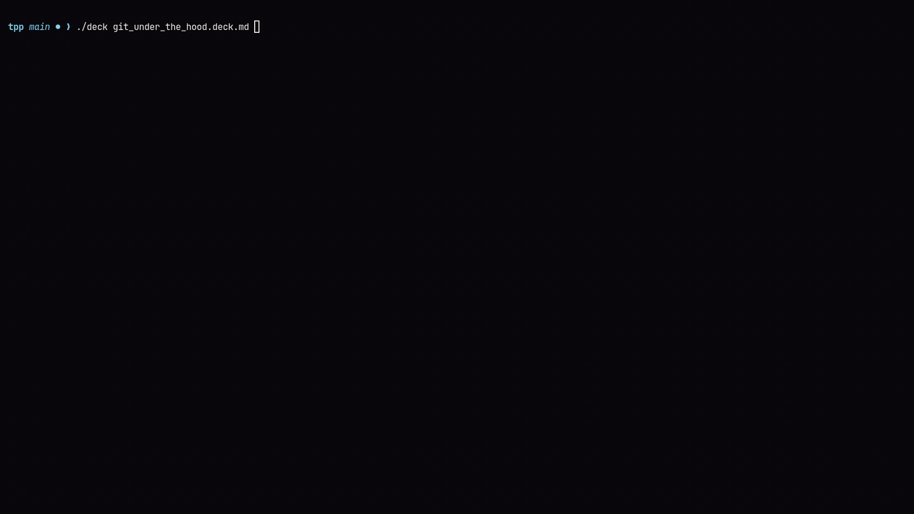
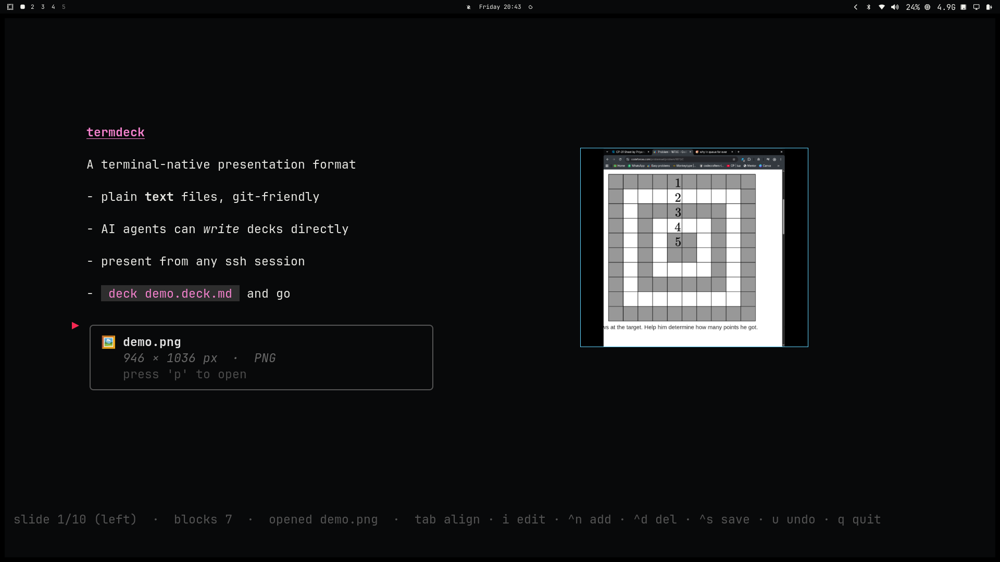
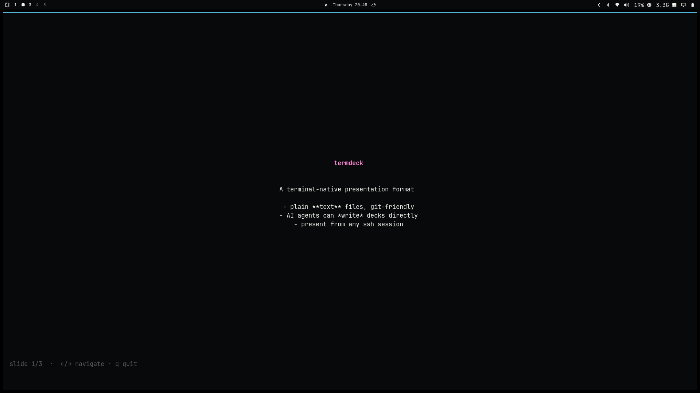

# Termdeck

Terminal presentation tool. Write slides in markdown, present and edit full-screen in your terminal.

## Install

```bash
go build -o deck .
```

## Usage

```bash
deck demo.deck.md
```

## Project Status

#### 22 September 2026
- [x] Distraction-free Zen Mode (`z`) for clean presentations and video demos
- [x] Native Markdown code diff syntax highlighting (```` ```diff ````) with green additions and red deletions
- [x] Extended modern developer syntax highlighting (Go, Rust, TypeScript, Python, SQL)
- [x] Native Markdown Callout & Admonition boxes (`> [!TIP]`, `> [!NOTE]`, `> [!WARNING]`, `> [!IMPORTANT]`, `> [!CAUTION]`, `> quote`) with themed rounded borders
- [x] Quick Slide Jump modal (`/`) with instant numeric jumping and live slide title search
- [x] Interactive Task Checklists (`- [x]` / `- [ ]`) with live `x` key toggling, green checkmarks (`✔`), and auto-save
- [x] Native Horizontal Dividers (`***` / `___` / `::hr`) with subtle themed hairline styling
- [x] Code Block Line Numbers (`L`) toggleable on the fly with dimmed gutter styling
- [x] Presentation Stopwatch & Talk Pacing Timer (`c` / `C`) with live per-second ticking and status bar display
- [x] Live File Watch (`-w` / `--watch`) and manual reload (`r` / `R`) for dual-monitor workflows
- [x] Slide Overview & 2D Grid Sorter (`o` / `O`) for visual deck restructuring and fast multi-slide navigation
- [x] Code Yank to Clipboard (`y` / `Y`) with OSC 52 ANSI escape codes and system clipboard fallback
- [x] Presentation Screen Blackout (`b` / `B`) to refocus audience attention with instant any-key resume
- [x] Standalone Offline HTML Deck Export (`--export-html` flag and `E` key) with zero dependencies and embedded base64 assets
- [x] Talk Statistics & Sprint Velocity Metrics (`S` key and `--stats` CLI flag) with speaking time estimation (130 WPM) and checklist velocity bar
- [x] 86 automated unit tests with comprehensive coverage (91.0% in internal/) and zero regressions

#### 20 September 2026
- [x] Dynamic Theme Engine (9 curated palettes + custom hex) with live cycling (`t`/`T`/`F2`)
- [x] Non-intrusive hairline slide progress indicator along bottom edge
- [x] Native Markdown tables with borders, alignment, and styled headers
- [x] Native Markdown fenced code blocks (```` ```lang ````) and syntax highlighting
- [x] Speaker notes privacy overlay (`n`) isolated from audience view
- [x] In-app keyboard shortcuts & controls help modal (`?`/`F1`)
- [x] Educational "Git Under The Hood" example presentation for CS students
- [x] 45 automated unit tests with 92.2% statement coverage



#### 18 September 2026
- [x] Text body alignment (`left`, `center`, `right`) with `Tab`/`Ctrl+A`
- [x] High-contrast laser pointer indicator (`▶ `)
- [x] Stepped opacity heading hierarchy (pink underline for H1)
- [x] Image presentation cards with system viewer integration (`p`)
- [x] Auto-save on alignment toggle, edit confirm, and quit
- [x] Complete automated test suite (91.7% statement coverage)
- [x] Makefile developer automation (`make test`, `make coverage`, `make bench`, `make lint`)



#### 17 September 2026
- [x] Basic start with core logic in main.go
- [x] Full-screen viewer with keyboard navigation
- [x] Inline styling, heading levels, code blocks
- [x] Block-based editor with undo/redo
- [x] Save to `.deck.md`



## Project Structure

```
tpp/
├── main.go              # Entry point, tea.Model
├── main_test.go         # Model lifecycle & CLI bootstrap unit tests
├── internal/
│   ├── model.go         # Block types, Deck/Slide parsing, serialization
│   ├── model_test.go    # Parser & serializer tests, edge cases, benchmarks
│   ├── view.go          # Rendering, styles, syntax highlighting
│   ├── view_test.go     # Highlighting lexer, styling, view benchmarks
│   ├── editor.go        # Edit mode, block operations, undo/redo
│   ├── editor_test.go   # Navigation, keyboard dispatch, edit mode tests
│   ├── export.go        # Standalone HTML export, CSS/JS bundling, base64 images
│   ├── export_test.go   # HTML export tests, formatting, file output verification
│   ├── image.go         # Terminal image renderer (ANSI half-blocks)
│   ├── image_test.go    # Path resolution, format probing, card tests
│   ├── stats.go         # Talk statistics, density metrics, duration estimation
│   └── stats_test.go    # Metrics calculation, progress bar, CLI format tests
├── demo.deck.md         # Sample deck
├── git_under_the_hood.deck.md # Deep-dive example presentation
├── Makefile             # Developer automation (test, coverage, lint, bench, build)
├── go.mod
├── go.sum
├── .gitignore
├── README.md
└── TTP_Documentation/
    ├── CHANGELOG.md
    ├── specs/
    │   └── format.md    # Format v0.1 specification
    ├── development/
    │   ├── architecture.md # Technical architecture & deep-dive
    │   ├── testing.md      # Complete QA & testing guide
    │   ├── images/         # Screenshots & demos (1.png, 2.png, demo.gif)
    │   └── videos/         # Screen recordings
    └── api/                # API docs (future)
```

## Usage

```bash
deck [options] <file.deck.md>

# Options:
#   -s, --start-at <N>   Start at slide N
#   -t, --theme <name>   Set presentation theme
#       --list-themes    List all available themes
#   -w, --watch          Watch file for external changes and auto-reload
#       --stats          Print presentation statistics and metrics to terminal
#       --export-html    Export presentation to standalone HTML file
#   -h, --help           Show help
#   -v, --version        Show version
```

## Keys — Viewer

| Key | Action |
|-----|--------|
| `→` `l` `Space` `Enter` `PageDown` | Next slide |
| `←` `h` `PageUp` `Backspace` | Previous slide |
| `↓` `j` | Move block cursor / laser pointer down |
| `↑` `k` | Move block cursor / laser pointer up |
| `/` | Quick Jump to slide (enter slide number or title search) |
| `o` / `O` | Slide Overview & 2D Grid Sorter (navigate cards, Enter to jump) |
| `?` `F1` | Toggle in-app keyboard shortcuts help modal |
| `t` `T` `F2` | Cycle color theme (`tokyo-night`, `dracula`, `nord`, etc.) |
| `z` | Toggle distraction-free zen mode (hides status bar) |
| `c` / `C` | Toggle presentation stopwatch (`c`) / Reset timer to 00:00 (`C`) |
| `r` / `R` | Reload deck file from disk (manual refresh) |
| `y` / `Y` | Yank focused code block or text to clipboard (OSC 52 + system) |
| `b` / `B` | Blank/blackout presentation screen (any key resumes) |
| `E` | Export deck to standalone offline HTML presentation |
| `S` | Talk statistics & sprint deck metrics modal |
| `L` | Toggle code block line numbers |
| `x` | Toggle task checklist item (`[ ]` ⇄ `[x]`) & auto-save |
| `n` | Toggle speaker notes overlay (hidden from audience by default) |
| `Tab` `Ctrl+A` | Cycle alignment (`left` → `center` → `right`) & auto-save |
| `p` | Open focused image in system viewer |
| `G` | Last slide |
| `g` | First slide |
| `q` `Ctrl+C` | Quit (auto-saves any unsaved changes) |
| `Esc` | Close help modal / clear message status |

## Keys — Editor

Press `i` to enter edit mode on the selected block. Press `Esc` to exit edit mode.

| Key | Action |
|-----|--------|
| `↑` `k` | Move cursor up |
| `↓` `j` | Move cursor down |
| `i` | Enter edit mode |
| `Esc` `Ctrl+C` | Exit edit mode / cancel |
| `Enter` | Confirm edit & auto-save to file |
| `Ctrl+N` | Add new block |
| `Ctrl+D` | Delete block |
| `Ctrl+K` | Move block up |
| `Ctrl+J` | Move block down |
| `Ctrl+S` | Save file manually |
| `u` | Undo |
| `Ctrl+R` | Redo |

## Features

- Full-screen (alternate screen buffer)
- Auto-resizes on terminal resize
- Configurable alignment: `left`, `center`, `right` (via `Tab`, `::align`, or frontmatter)
- **Automatic saving**: Saves immediately on alignment toggle (`Tab`/`Ctrl+A`), on theme change (`t`/`T`/`F2`), on edit confirm (`Enter`), and on exit (`q`/`Ctrl+C`)
- Manual save anytime with `Ctrl+S`
- **Dynamic Theme Engine**: 9 curated color palettes (`tokyo-night`, `dracula`, `catppuccin`, `nord`, `gruvbox`, `monokai`, `solarized`, `cyberpunk`, `termdeck`) plus custom hex colors (`#3b82f6`)
- Live theme switching with `t` / `T` / `F2`
- Frontmatter theme specification (`theme: dracula`) and CLI option (`--theme <name>`, `--list-themes`)
- Inline styling: **bold**, *italic*, `code`
- Heading levels (h1–h6) with clean visual hierarchy
- **Standard Markdown Fenced Code Blocks** (```` ```lang ````) and `::code lang=X` blocks with syntax highlighting and `diff`/`patch` support
- **Code Block Line Numbers**: Press `L` anytime to toggle subtle line numbers in code and diff blocks with auto-expanding gutters
- **Presentation Stopwatch & Talk Timer**: Press `c` to toggle an active elapsed talk timer (`[⏱ MM:SS]`) with per-second live updates, and `C` to reset
- **Distraction-Free Zen Mode**: Toggle off all status bars with `z` for pure presentation focus
- **Standard Markdown Images** (``) and `::image` presentation cards with system viewer integration (`p`)
- **Markdown Tables** (`| col1 | col2 |`) with formatted borders and headers
- **Callout & Admonition Cards**: Native `> [!TIP]`, `> [!NOTE]`, `> [!WARNING]`, `> [!IMPORTANT]`, `> [!CAUTION]`, and `> quote` with custom themed borders and icons
- **Interactive Task Checklists**: Native `- [x]` / `- [ ]` lists with styled green checkmarks (`✔`), dim completed state, and instant `x` key toggle
- **Horizontal Dividers**: Clean section separators (`***`, `___`, `::hr`) rendered as subtle themed hairlines
- **Quick Slide Jump Modal**: Press `/` to jump instantly by slide number or live fuzzy title search
- `::notes` speaker notes (hidden from audience canvas; toggleable presenter overlay via `n`)
- **In-App Help Modal** (`?` / `F1`) detailing all viewer, presenter, and editor controls
- **Code Block & Element Yank (`y` / `Y`)**: Copy focused code snippets, commands, tables, or text directly to system clipboard via ANSI OSC 52 (works over SSH and tmux) and native OS clipboard utilities (`pbcopy`, `wl-copy`, `xclip`, `clip`)
- **Presentation Screen Blanking (`b` / `B`)**: Temporarily blank/blackout the screen to direct audience focus to the speaker during key verbal explanations; any key instantly resumes the slide
- **Slide Overview & 2D Grid Sorter**: Press `o` or `O` anytime to open a visual grid map of all slides with titles, block element counts, cursor focus, active slide indicator, and 2D arrow/hjkl navigation
- **Live File Watch & Hot-Reload**: Start with `-w` or `--watch` to auto-reload on file edits from external editors/IDEs, or press `r` / `R` anytime to reload manually (safeguards protect active in-app edit sessions)
- **CLI Options**: `--watch` (`-w`), `--theme <name>`, `--list-themes`, `--start-at N`, `--version`, `--help`
- Block-based editor with live editing
- Undo/redo
- Save to `.deck.md`

## Testing & Development

Termdeck features an automated test suite achieving **90.6% statement coverage** in `internal/` with 76 unit tests and 2 performance benchmarks.

```bash
# Run all unit tests with coverage summary
make test

# Generate an interactive HTML coverage report
make coverage

# Display per-function statement coverage
make coverage-summary

# Run performance benchmarks
make bench

# Verify formatting and static analysis
make lint
```

For full details, see:
- [Technical Architecture Deep-Dive](TTP_Documentation/development/architecture.md)
- [Developer Testing & QA Guide](TTP_Documentation/development/testing.md)

## Format

See `TTP_Documentation/specs/format.md` for the full format specification.

