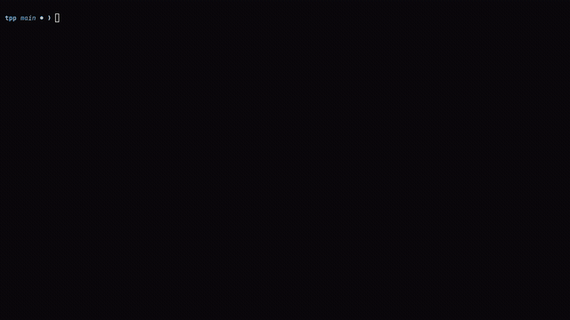

# Termdeck

> **Interactive Terminal Presentation Engine for Developers** — Non-linear branching graphs, bounded iteration cycles, live code execution, and sub-millisecond rendering in pure Go.

<p align="center">
  
</p>

Write presentations in standard Markdown, organize slides as **Directed Acyclic Graphs (DAGs) with bounded execution cycles**, and present full-screen in your terminal with real-time graph routing, live code execution, and zero runtime dependencies.

---

## Quick Start

### Installation

```bash
# Clone repository
git clone https://github.com/SachinyadavAug20/Termdeck.git
cd Termdeck

# Build static binary (zero runtime dependencies)
go build -o deck .
```

### Usage

```bash
# Launch interactive presentation
deck demo.deck.md

# View terminal ASCII topology map
deck --graph demo.deck.md

# Follow a pre-configured talk route (e.g. lightning talk)
deck --route=lightning demo.deck.md

# Export to standalone offline HTML presentation
deck --export-html demo.deck.md

# Run CI/CD code snippet testing across all slides
deck --test-code demo.deck.md
```

---

## Core Highlights

- **Non-Linear Graph Engine (DAGs)**: Break out of linear slides. Model decision branches (`::branch [key] Label -> target`), numeric jumping (`1`–`9`), and convergence milestones (`::next <slug>`).
- **Bounded Graph Cycles (`::loop` / `::cycle`)**: Model iterative processes (TDD Red -> Green -> Refactor, exponential retry backoff, Raft consensus rounds, ML epochs) with live pass counters (`pass 1/3`) and auto-exit guarantees.
- **Decision Fork HUD (`J`)**: Floating modal at branching forks displaying destination choices and real-time syntax-highlighted code and text previews before committing to a branch.
- **Waypoint Pathfinder (`W`)**: Real-time BFS shortest-path graph solver between any two slides with edge hop visualizer and speaking duration estimates (~130 WPM).
- **Exploration Radar (`V`) & Fast Fork Return (`U`)**: Sub-DAG completion matrix with unique reachability partitioning, plus one-key instant backtrack teleport to parent decision hubs.
- **Live Terminal Code Runner (`X`)**: Run Bash, Go, Python, Node.js, and Ruby blocks directly inside slides with output cards and exit codes.
- **Element Zoom & Focus Mode (`f` / `F`)**: Maximize complex architecture diagrams, tables, and code snippets to full viewport with vertical scrolling (`j`/`k`).
- **Preset Routes (`P`) & Audience Tracks (`K`)**: Filter presentation paths for different talk formats (lightning vs deep-dive) or audiences (executive vs engineering).
- **Traversal History & Reflog (`H`)**: Visual presentation journey stack with instant rewind capabilities (`1`–`9` or `Enter`).
- **Standalone Offline HTML Export (`E`)**: Single-file distributable HTML presentation with theme styling, embedded assets, and interactive JS graph navigation.
- **Dynamic Theme Engine**: 9 curated developer color schemes (`tokyo-night`, `dracula`, `nord`, `catppuccin`, `monokai`, etc.) plus custom hex colors.
- **Performance & Quality**: Sub-millisecond rendering (<0.26ms/op), 90.7% statement coverage across 155 unit tests, and zero runtime dependencies.

---

## Project Status

**Current Release**: `v0.13.0` (26 September 2026) | **Quality**: 155 unit tests | **Statement Coverage**: 90.7% | 0 linter warnings | **Rendering Latency**: 0.256 ms/frame.

Termdeck is actively developed with compiler-grade graph validation, verified performance benchmarks, and comprehensive documentation.

For the complete day-by-day development timeline, release notes, and feature additions from v0.1 to v0.13, see [`TTP_Documentation/CHANGELOG.md`](TTP_Documentation/CHANGELOG.md).

---

## Keyboard Controls

### Viewer Mode

| Key | Action |
|---|---|
| `Space` `Enter` `→` `l` `PageDown` | Next slide / advance directed edge / advance loop pass |
| `←` `h` `PageUp` | Previous slide / previous route slide |
| `1` – `9` | Jump directly along numbered branch or loop shortcut |
| `J` | Open interactive **Branch Decision Fork HUD** with live destination previews |
| `W` | Open **Waypoint Pathfinder** (BFS shortest-path router; `Enter` to route, `w` to step) |
| `V` | Open **Graph Exploration Radar** & completion matrix (`Enter` to jump, `u` to fork) |
| `U` | **Fast-return** to nearest upstream branch fork in traversal history |
| `Backspace` | Backtrack 1 slide along traversal history |
| `H` | Open **Traversal History & Reflog** modal (`1`–`9` or `Enter` to rewind) |
| `P` | Open **Preset Graph Routes** modal (`0` clears, `1`–`9` activates) |
| `K` | Open **Audience Tracks** modal (`0` clears, `1`–`9` activates) |
| `[` / `]` | Hop backward / forward along slides matching active audience track |
| `M` | Open interactive presentation graph map & DAG explorer modal |
| `X` `Ctrl+X` | Run focused code block live in background & show output card |
| `f` / `F` | Toggle **Element Zoom & Focus Mode** (full-viewport view with `j`/`k` scroll) |
| `↓` `j` / `↑` `k` | Move block cursor / laser pointer (or scroll in Focus Mode) |
| `/` | Quick Jump modal (numeric jump or live fuzzy title search) |
| `o` / `O` | Slide Overview & 2D Grid Sorter (navigate cards, `Enter` to jump) |
| `t` `T` `F2` | Cycle color theme (`tokyo-night`, `dracula`, `nord`, etc.) |
| `z` | Toggle distraction-free Zen mode (hides status bar) |
| `c` / `C` | Toggle presentation stopwatch (`c`) / Reset timer to 00:00 (`C`) |
| `A` | Toggle auto-advance rehearsal pacing mode |
| `r` / `R` | Reload deck file from disk (manual refresh) |
| `y` / `Y` | Yank focused code block, text, or runner output to clipboard (OSC 52) |
| `b` / `B` | Blank/blackout presentation screen (any key resumes) |
| `E` | Export deck to standalone offline HTML presentation |
| `S` | Presentation statistics & sprint deck metrics modal |
| `L` | Toggle code block line numbers |
| `x` | Run focused code block live (or toggle task checklist `[ ]` ⇄ `[x]`) |
| `n` | Toggle speaker notes overlay (hidden from audience canvas) |
| `Tab` `Ctrl+A` | Cycle alignment (`left` → `center` → `right`) & auto-save |
| `p` | Open focused image in system viewer |
| `g` / `G` | First slide (resets loops) / Last slide |
| `?` `F1` | In-app keyboard shortcuts help modal |
| `q` `Ctrl+C` | Quit (auto-saves any unsaved edits) |
| `Esc` | Dismiss runner card / exit focus mode / close modals |

### Editor Mode

Press `i` to enter in-place edit mode on the selected block. Press `Esc` to exit edit mode.

| Key | Action |
|---|---|
| `↑` `k` / `↓` `j` | Move text cursor up / down |
| `Enter` | Confirm edit & auto-save to file |
| `Ctrl+N` | Add new block |
| `Ctrl+D` | Delete focused block |
| `Ctrl+K` / `Ctrl+J` | Move block up / down |
| `Ctrl+S` | Save file manually |
| `u` / `Ctrl+R` | Undo / Redo |
| `Esc` `Ctrl+C` | Exit edit mode / cancel |

---

## CLI Options

```bash
deck [options] <file.deck.md>

# Options:
#   -s, --start-at <N>   Start at slide N
#   -k, --track <name>   Filter slides and DAG navigation to audience track
#       --route <name>   Follow pre-planned graph presentation route
#   -t, --theme <name>   Set presentation theme
#       --list-themes    List all available themes
#   -w, --watch          Watch file for external changes and auto-reload
#   -a, --autoplay <sec> Auto-advance slides every N seconds (default: 5)
#       --graph          Print presentation topology map (ASCII DAG) to terminal
#       --mermaid        Print presentation topology as Mermaid diagram syntax
#       --test-code      Execute all runnable code blocks and assert zero errors (CI/CD)
#       --run-slide <N>  Execute code block on slide N directly in terminal
#       --stats          Print presentation statistics and metrics to terminal
#       --export-html    Export presentation to standalone HTML file
#       --lint           Validate DAG topology for broken links, unreachable slides, and dead ends
#   -h, --help           Show help
#   -v, --version        Show version
```

---

## Documentation & Deep-Dives

Detailed technical documentation and developer guides are maintained in [`TTP_Documentation/`](TTP_Documentation/):

- **[Technical Architecture Deep-Dive](TTP_Documentation/development/architecture.md)**: Comprehensive architectural breakdown of the Elm Architecture loop, AST tokenization, Lipgloss styling pipeline, Sub-DAG reachability partitioning, state machines, and bounded cycle execution.
- **[Developer Testing & QA Guide](TTP_Documentation/development/testing.md)**: Testing philosophy, test inventory (155 tests), statement coverage breakdown (90.7%), benchmarks, and contributing guidelines.
- **[Full Changelog & Timeline](TTP_Documentation/CHANGELOG.md)**: Complete chronological changelog detailing every feature, release, and engineering enhancement from v0.1 to v0.13.
- **[Deck Format Specification](TTP_Documentation/specs/format.md)**: Syntax reference for slides, directives (`::branch`, `::loop`, `::next`, `::tags`, `::columns`), callout cards, and code blocks.

---

## Project Structure

```
tpp/
├── main.go              # Entry point, CLI flags, tea.Model lifecycle
├── main_test.go         # Model lifecycle & CLI bootstrap unit tests
├── internal/
│   ├── model.go         # Block types, Deck/Slide parsing, serialization
│   ├── model_test.go    # Parser & serializer tests, edge cases, benchmarks
│   ├── view.go          # Rendering, styles, syntax highlighting, layout
│   ├── view_test.go     # Highlighting lexer, styling, view benchmarks
│   ├── editor.go        # Edit mode, block operations, undo/redo, navigation
│   ├── editor_test.go   # Navigation, keyboard dispatch, edit mode tests
│   ├── export.go        # Standalone HTML export, CSS/JS bundling
│   ├── export_test.go   # HTML export tests, formatting, file output verification
│   ├── graph.go         # DAG topology, BFS routing, loops, radar, ASCII map, Mermaid
│   ├── graph_test.go    # Graph builder, shortest path, loops, linter tests
│   ├── runner.go        # Subprocess live code executor (bash, python, go, etc.)
│   ├── runner_test.go   # Subprocess timeouts, dedent, CI code test assertions
│   ├── image.go         # Terminal image renderer (ANSI half-blocks)
│   ├── image_test.go    # Path resolution, format probing, card tests
│   ├── stats.go         # Talk statistics, density metrics, duration estimation
│   └── stats_test.go    # Metrics calculation, progress bar, CLI format tests
├── demo.deck.md         # Comprehensive sample deck showcasing all features
├── git_under_the_hood.deck.md # Example technical presentation
├── Makefile             # Automation: test, coverage, lint, bench, build
├── go.mod
├── go.sum
├── .gitignore
├── README.md
└── TTP_Documentation/
    ├── CHANGELOG.md     # Complete chronological release history
    ├── specs/
    │   └── format.md    # Format v0.1 specification
    └── development/
        ├── architecture.md # Complete technical architecture & deep-dive
        ├── testing.md      # Testing guide & benchmarks
        ├── images/         # Screenshots & demos (termdeck_demo.gif)
        └── videos/         # Source screen recordings
```

---

## Testing & Benchmarks

```bash
# Run all unit tests with coverage summary
make test

# Generate an interactive HTML coverage report
make coverage

# Display per-function statement coverage
make coverage-summary

# Run performance benchmarks
make bench

# Verify formatting and static analysis
make lint
```
