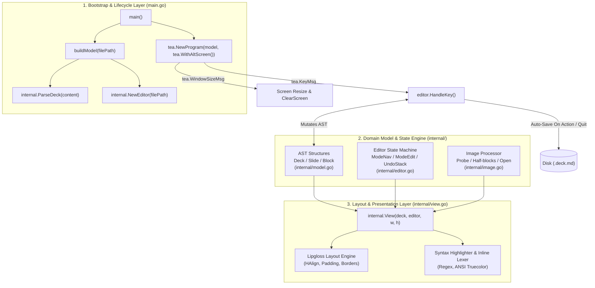
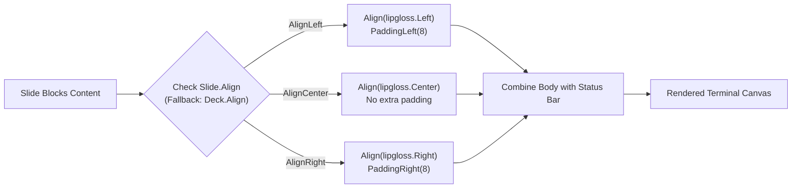
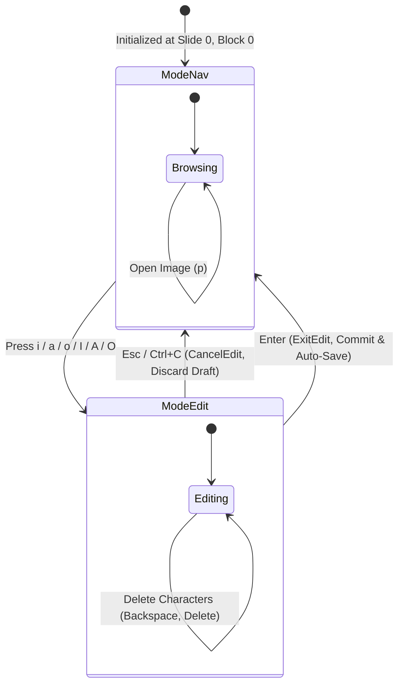
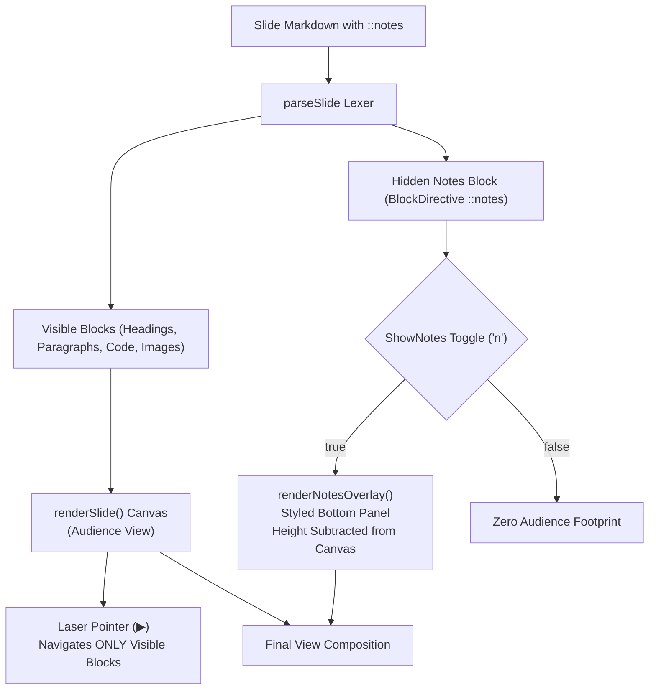

# Termdeck Technical Architecture & Deep-Dive

This document provides a comprehensive technical breakdown of **Termdeck (`deck`)**, explaining every engineering layer from terminal escape codes and Bubble Tea's Elm Architecture loop to AST tokenization, Lipgloss styling calculations, state machines, and disk persistence.

---

## Table of Contents

1. [High-Level Architecture & Component Map](#1-high-level-architecture--component-map)
2. [CLI Bootstrap & The Elm Architecture (`main.go`)](#2-cli-bootstrap--the-elm-architecture-maingo)
3. [Abstract Syntax Tree (AST) & Lexer (`internal/model.go`)](#3-abstract-syntax-tree-ast--lexer-internalmodelgo)
4. [Terminal UI & Lipgloss Rendering Pipeline (`internal/view.go`)](#4-terminal-ui--lipgloss-rendering-pipeline-internalviewgo)
5. [Editor State Machine & In-Place Buffer (`internal/editor.go`)](#5-editor-state-machine--in-place-buffer-internaleditorgo)
6. [Image Subsystem & ANSI Rendering (`internal/image.go`)](#6-image-subsystem--ansi-rendering-internalimagego)
7. [Storage & Auto-Save Invariant](#7-storage--auto-save-invariant)
8. [Testing Architecture & Benchmarks](#8-testing-architecture--benchmarks)

---

## 1. High-Level Architecture & Component Map

Termdeck is written in pure Go with zero external dependencies beyond standard Charmbracelet terminal libraries (`bubbletea` and `lipgloss`).



---

## 2. CLI Bootstrap & The Elm Architecture (`main.go`)

The entry point [`main.go`](file:///home/sachin/Projects/tpp/main.go) orchestrates program startup, terminal isolation, and event routing via Charmbracelet's **Bubble Tea**, an implementation of **The Elm Architecture (TEA)**.

### The Elm Loop Lifecycle

The program operates as a reactive state machine governed by three primary methods:

$$\text{Model} \xrightarrow{\text{Msg}} \text{Update(Msg)} \longrightarrow (\text{New Model}, \text{Cmd}) \xrightarrow{} \text{View(New Model)}$$

```mermaid
sequenceDiagram
    participant User as Terminal User
    participant Loop as Bubble Tea Runtime
    participant Model as model struct
    participant Editor as internal.Editor
    participant Disk as File System

    User->>Loop: Key Press (e.g. 'Tab' or 'i')
    Loop->>Model: Update(tea.KeyMsg)
    Model->>Editor: HandleKey(msg, &m.deck)
    alt Navigation Action (Tab)
        Editor->>Editor: ToggleAlign(&d)
        Editor->>Disk: Auto-Save Deck
    else Edit Mode (i)
        Editor->>Editor: EnterEdit(&d)
    end
    Editor-->>Model: returns tea.Cmd (nil or tea.Quit)
    Model-->>Loop: returns (updated model, cmd)
    Loop->>Model: View()
    Model-->>Loop: Rendered ANSI string
    Loop->>User: Draws frame to alternate screen
```

### Critical Implementation Details:

1. **Alternate Screen Isolation (`tea.WithAltScreen()`)**:
   - When `main()` initializes `tea.NewProgram(m, tea.WithAltScreen())`, Bubble Tea emits the ANSI escape sequence `\x1b[?1049h`.
   - This switches the terminal to an isolated virtual screen buffer, preventing presentations from polluting the user's terminal scrollback history.
   - Upon exit, `\x1b[?1049l` restores the shell prompt exactly as it was before launch.

2. **First Resize Artifact Suppression**:
   - Modern terminal emulators emit a `tea.WindowSizeMsg` immediately upon startup.
   - In `model.Update`:
     ```go
     case tea.WindowSizeMsg:
         m.width = msg.Width
         m.height = msg.Height
         if !m.resized {
             m.resized = true
             return m, tea.ClearScreen
         }
     ```
   - Emitting `tea.ClearScreen` on the very first resize guarantees that any previous terminal artifacts are flushed before slide 1 renders.

3. **Graceful Shutdown Persistence Hook**:
   - When `p.Run()` finishes, `main.go` captures `finalModel`:
     ```go
     finalModel, err := p.Run()
     if fm, ok := finalModel.(model); ok && fm.editor.Dirty && fm.editor.FilePath != "" {
         fm.editor.Save(fm.deck)
     }
     ```
   - This invariant ensures that if the process terminates unexpectedly or is interrupted, no uncommitted work is lost.

---

## 3. Abstract Syntax Tree (AST) & Lexer (`internal/model.go`)

Termdeck converts `.deck.md` files into a strongly-typed Abstract Syntax Tree ([`internal/model.go`](file:///home/sachin/Projects/tpp/internal/model.go)).

### Data Model

```go
type BlockKind int

const (
    BlockHeading BlockKind = iota // Headings (H1 to H6)
    BlockParagraph                // Markdown paragraphs
    BlockCode                     // Fenced code with syntax tags
    BlockImage                    // Local or relative images
    BlockDirective                // Directives (::notes, etc.)
    BlockList                     // Bullets (- / *) and numbered (1.)
)

type Block struct {
    Kind      BlockKind
    Level     int        // Heading level (1-6)
    Text      string     // Text content or bullet text
    Lang      string     // Language identifier for code highlighting
    Lines     []string   // Individual lines for multiline code
    Src       string     // Path to referenced image
    Directive string     // Full directive line
    Raw       string     // Raw source line
}

type Slide struct {
    Blocks []Block
    Align  AlignKind // "left", "center", "right"
}

type Deck struct {
    Meta    map[string]string // Parsed YAML frontmatter
    Slides  []Slide           // Slide array
    BaseDir string            // Directory of .deck.md for relative paths
    Align   AlignKind         // Deck-wide fallback alignment
}
```

### Parsing Pipeline:

1. **YAML Frontmatter Lexing**:
   - Checks if line 0 is `---`.
   - Iterates lines until the closing `---` delimiter.
   - Splits on `:` to populate `deck.Meta` (e.g. `title: ...`, `author: ...`, `align: left`).
2. **Slide Delimitation (`---`)**:
   - The remaining content is split into slide groups (`[][]string`) using `---` as the slide boundary.
3. **Block Lexing (`parseSlide`)**:
   - **Directives (`::`)**: Lines starting with `::` are parsed via `ParseDirective(line)`.
     - `::code lang=X` initiates a code block accumulator until closed.
     - `::align left|center|right` (or shorthand `::left`, `::center`, `::right`) assigns slide-level alignment.
     - `::image path` becomes a `BlockImage`.
     - All other directives (such as `::notes`) become `BlockDirective`.
   - **Headings (`#`)**: Lines starting with `#` are counted to determine heading level (1 to 6) and stripped of `#` prefixes.
   - **Lists (`- `, `* `, `1. `)**: Lines matching list prefixes become `BlockList`.
   - **Paragraphs**: Sequential plain text lines are grouped into `BlockParagraph`.

---

## 4. Terminal UI & Lipgloss Rendering Pipeline (`internal/view.go`)

Rendering terminal UIs requires precise column/row accounting ([`internal/view.go`](file:///home/sachin/Projects/tpp/internal/view.go)).

### 1. Slide Layout & Alignment Engine

Lipgloss provides layout calculation using ANSI-aware string measurements (`lipgloss.Width(str)` ignores invisible escape sequences).



- **Left Alignment**: Uses `PaddingLeft(8)` to create a book-style left margin. This aligns bullet points vertically without jagged centering.
- **Center Alignment**: Standard presentation centering for title slides and quotes.
- **Right Alignment**: Uses `PaddingRight(8)` for asymmetrical slide layouts.

### 2. Tailored Dynamic Code Box Sizing

Standard Markdown tools render code blocks across the full width of the terminal. Termdeck dynamically calculates the exact bounding box needed:

$$\text{boxWidth} = \max(\text{len}(\text{longestLine}), \text{len}(\text{lang}) + 6) + 6$$

Clamped between 32 and terminal width minus 8:
```go
boxW := maxCodeLineLen + 6
if boxW > w-8 { boxW = w - 8 }
if boxW < 32  { boxW = 32 }
```
A dimmed badge showing the language (`go`, `python`, `bash`) is right-aligned above the rounded border.

### 3. Laser Pointer Placement (`▶ `)

To guide audience attention, the active block receives a high-contrast laser pointer indicator:
- **Glyph**: `▶ `
- **Color**: `#FF2A55` (Neon laser pink/red)
- **Positioning**: Prefixed directly onto line 0 of the focused block. Non-focused blocks receive a 2-space indentation prefix (`"  "`), guaranteeing that headings and text maintain stable alignment when navigating through the slide.

### 4. Heading Hierarchy & Color Theory

Headings follow a calibrated opacity and weight hierarchy:

| Heading | Style | Visual Representation |
|---|---|---|
| **H1** | Pink (`Color("212")`), Bold, Underlined | High-impact title |
| **H2** | White (`#FFFFFF`), Bold | Primary section header |
| **H3** | Light Grey (`#D8D8D8`), Bold | Secondary section header |
| **H4** | Medium Grey (`#B0B0B0`), Normal | Subsection title |
| **H5** | Darker Grey (`#888888`), Normal | Grouping title |
| **H6** | Dim Grey (`#606060`), Normal | Minor header |

### 5. Syntax Highlighter & Inline Markdown Lexer

The syntax highlighter is a zero-dependency lexer:
1. **Comment Detection**: Slices starting with `#`, `//`, or `--` are styled with `syntaxComment` and return immediately.
2. **String Literals**: Quoted substrings (`"..."`, `'...'`, `` `...` ``) with escape sequence handling are styled with `syntaxString`.
3. **Numeric Literals**: Digits and decimals are highlighted with `syntaxNumber`.
4. **Keywords & Types**: Words are matched against `simpleKeywords` (e.g. `func`, `return`, `def`, `class`, `echo`, `import`). Capitalized words default to `syntaxType`.
5. **Collision-Free Inline Markdown**:
   - Before applying regex for bold (`**...**`) or italic (`*...*`), inline code spans (`` `...` ``) are extracted and replaced with null-byte placeholders:
     $$\text{Text} \xrightarrow{} \text{"\x00CODE0\x00"} \xrightarrow{\text{Bold/Italic}} \text{Styled Text} \xrightarrow{} \text{Restore Code Spans}$$
   - This prevents asterisks inside code spans from triggering unwanted italic/bold styles.

---

## 5. Editor State Machine & In-Place Buffer (`internal/editor.go`)

Termdeck includes a live, in-place markdown editor ([`internal/editor.go`](file:///home/sachin/Projects/tpp/internal/editor.go)).



### Undo/Redo Engine:
- Before any state change (`AddBlock`, `DeleteBlock`, `MoveBlockUp`, `MoveBlockDown`, `AddSlide`, `DeleteSlide`, `ExitEdit`, `ToggleAlign`), the current deck is serialized into Markdown text and pushed onto `e.UndoStack []string`.
- The stack is capped at 100 entries to prevent memory growth.
- Pressing `u` pushes the current state to `RedoStack`, pops the last state from `UndoStack`, and calls `ParseDeck(state)`.

---

## 6. Image Subsystem & ANSI Rendering (`internal/image.go`)

Image processing is handled in [`internal/image.go`](file:///home/sachin/Projects/tpp/internal/image.go) through two complementary approaches:

### 1. Interactive Presentation Cards
Instead of stretching low-res pixel approximations across the slide, Termdeck displays a formatted card:
- Probes format (PNG, JPEG, GIF) and pixel dimensions using Go's `image.DecodeConfig`.
- Displays filename, dimensions (`946 × 1036 px`), format badge, and interactive hint: `press 'p' to open`.

### 2. Desktop Viewer Launch (`p`)
Pressing `p` spawns a detached viewer process matching the host OS:
```go
func openFile(path string) error {
    var cmd *exec.Cmd
    switch runtime.GOOS {
    case "darwin":
        cmd = exec.Command("open", path)
    case "windows":
        cmd = exec.Command("cmd", "/c", "start", path)
    default:
        cmd = exec.Command("xdg-open", path)
    }
    return cmd.Start()
}
```

### 3. Truecolor ANSI Half-Block Engine (`RenderImage`)
For headless terminals or ASCII art fallbacks, Termdeck converts pixels into half-block characters (`▀`):
- Each character cell has 2 vertical sub-pixels.
- Foreground color is set to the top pixel's RGB: `\x1b[38;2;R;G;Bm`.
- Background color is set to the bottom pixel's RGB: `\x1b[48;2;R;G;Bm`.
- The character `▀` (upper half block) is printed, doubling terminal vertical resolution.

---

## 7. Storage & Auto-Save Invariant

Termdeck guarantees zero data loss via an automatic persistence invariant:

```mermaid
flowchart TD
    UserAction["User Action"] --> ActionType{"Action Type"}
    
    ActionType -->|Toggle Alignment (Tab / Ctrl+A)| Save1["ToggleAlign() -> e.Save(*d) -> Disk"]
    ActionType -->|Confirm Edit (Enter)| Save2["ExitEdit() -> e.Save(*d) -> Disk"]
    ActionType -->|Quit Presentation (q / Ctrl+C)| CheckDirty{"Is e.Dirty true?"}
    
    CheckDirty -->|Yes| Save3["handleNav() -> e.Save(*d) -> Disk"]
    CheckDirty -->|No| Exit["return tea.Quit"]
    Save3 --> Exit

    ActionType -->|Manual Save (Ctrl+S)| Save4["Save() -> Disk"]
    
    Exit --> BubbleTeaExit["p.Run() exits"]
    BubbleTeaExit --> SafetyNet{"Final Model Dirty?"}
    SafetyNet -->|Yes| Save5["fm.editor.Save(fm.deck)"]
    SafetyNet -->|No| CleanExit["Process Terminated"]
    Save5 --> CleanExit
```

| Action | Persistence Mechanism | Visual Feedback |
|---|---|---|
| **Alignment Toggle (`Tab` / `Ctrl+A`)** | Immediate disk write | Status bar: `align: right (saved)` |
| **Confirm Edit (`Enter`)** | Immediate disk write | Status bar: `saved` |
| **Quit (`q` / `Ctrl+C`)** | Pre-quit disk write if `Dirty` | Seamless exit without loss |
| **Program Shutdown (`main.go`)** | Final model check after `p.Run()` | Safety net against crashes |
| **Manual Save (`Ctrl+S`)** | Explicit disk write | Status bar: `saved` |

---

## 8. Testing Architecture & Benchmarks

The testing framework uses standard Go `testing` without third-party frameworks:

### ANSI-Resilient Assertions (`stripANSI`)
Because Lipgloss interleaves ANSI escape codes for colors and underlines, standard string comparisons (`strings.Contains`) would fail. All tests use a regex stripper:
```go
var reANSI = regexp.MustCompile(`\x1b\[[0-9;]*[a-zA-Z]`)
func stripANSI(s string) string {
    return reANSI.ReplaceAllString(s, "")
}
```

### Coverage & Performance Benchmarks

```bash
$ make test
ok   deck            coverage: 60.0% of statements
ok   deck/internal   coverage: 92.6% of statements
total statement coverage: 91.6%

$ make bench
BenchmarkParseDeck-8       353647       2863 ns/op        4176 B/op      24 allocs/op
BenchmarkRenderView-8        4861     240812 ns/op       68494 B/op     630 allocs/op
```

- **Markdown Parser**: ~2.8 microseconds per slide deck.
- **Render Engine**: ~0.24 milliseconds per frame (>4,000 FPS capability), providing instantaneous keystroke response in the terminal.

---

## 9. Speaker Notes Subsystem & Presenter Mode

Termdeck strictly separates audience presentation canvas from private speaker notes:



### Key Architectural Safeguards:

1. **Multi-Line Lexer Accumulator (`internal/model.go`)**:
   Lines below `::notes` are collected into `Block.Lines` and `Block.Text` rather than leaking into the Markdown paragraph stream.
2. **Decoupled Block Indexing (`VisibleBlockIndices()`)**:
   Navigation methods (`MoveUp`, `MoveDown`, `MoveBlockUp`, `MoveBlockDown`, `DeleteBlock`) map through `slide.VisibleBlockIndices()`. The block cursor and laser pointer (`▶ `) never point to hidden notes.
3. **Dynamic Viewport Height Accounting**:
   When `ShowNotes` is active, `lipgloss.Height(notesOverlay)` is subtracted from `bodyHeight`, ensuring the total terminal frame height matches `height` without screen scrolling or line jitter.
4. **Contextual Status Bar Badges**:
   The status bar counts only visible slide blocks (`blocks 2` instead of `blocks 3`) and renders `[n: notes]` or `[n: notes open]` whenever notes exist.
